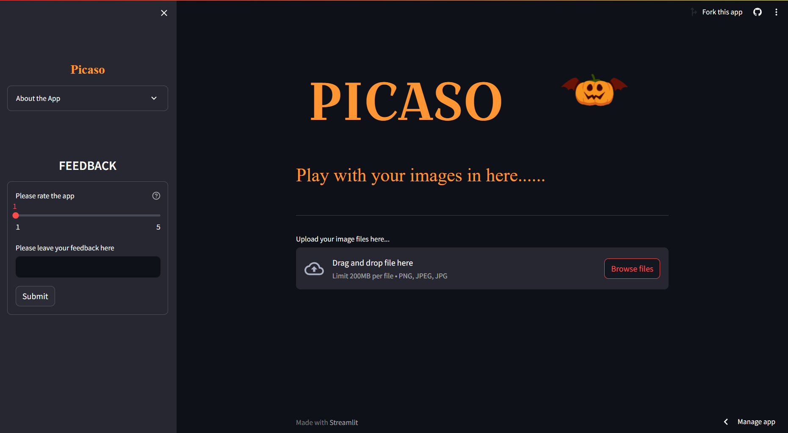
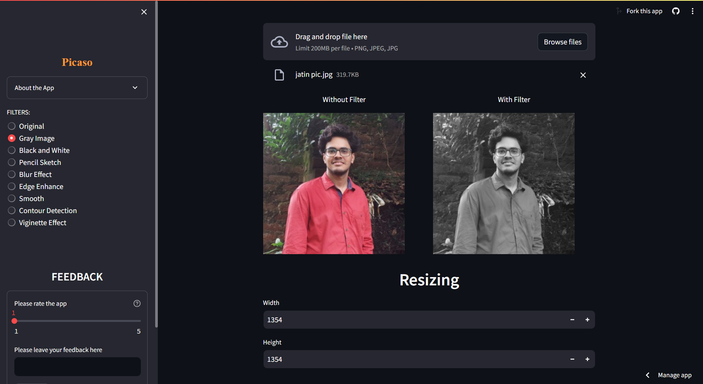
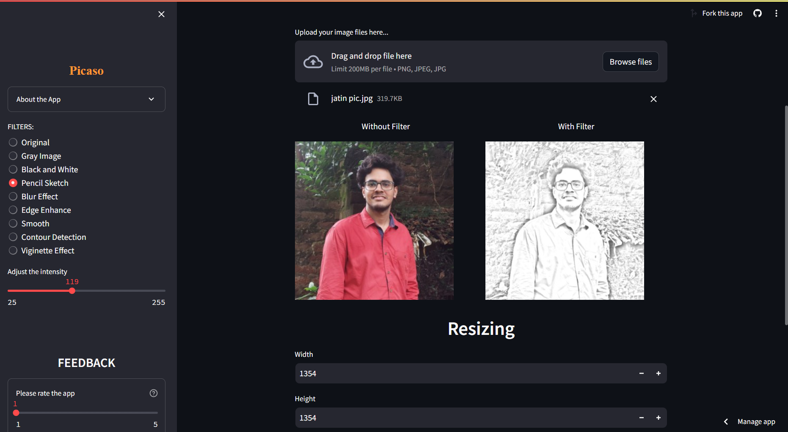
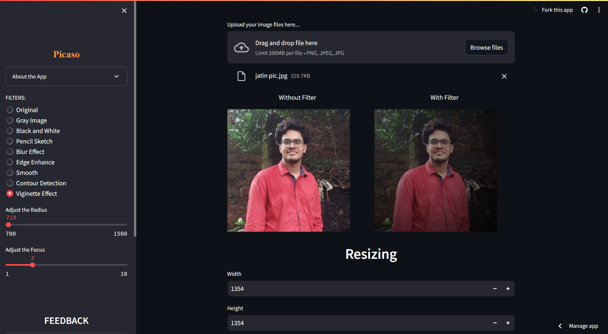

# Picaso
An Image Editing App made using Streamlit , OpenCV and PIL. 
<h2><b>Logic of project</b></h2>
The project includes direct working with the filters of PIL and OpenCV library. 
<b>Python Imaging Library(PIL)</b> is a free and open-source additional library for the Python programming language that adds support for opening, manipulating, and saving many different image file formats. 
<b>OpenCV</b> (Open Source Computer Vision Library) is an open source computer vision and machine learning software library.
 
 

  

<h2><b>The Working of the project</b></h2>
<ul><li>You can manipulate your image in various ways using this app.
<li>You can convert your image into <b>grayscale</b>, <b>black and white</b> and many other filters</i>.
<li>After applying filters you can also <b>rotate</b> and <b>resize</b> your image.</ul>
 

<b><h2>Graysacle Image</h2></b>
 

<b><h2>Pencil sketch</h2></b>
 

<b><h2>Viginette Effect</h2></b>
 

 
Check out the <b>Deployed</b> site <a href = "https://picaso.streamlit.app"><u>here.</u></a>

